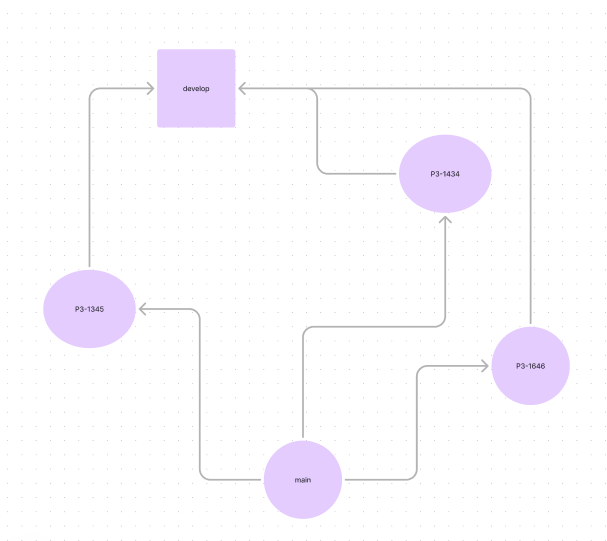
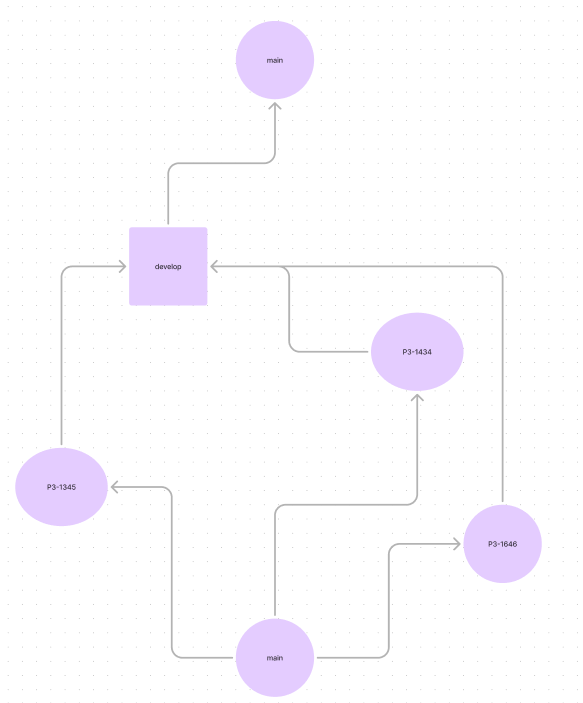

# Работа с гитом

Если в проекте нет правил по работе с гитом, рекомендуется использовать следующий подход.

### Правила:

- main — прод ветка самая актуальная
- Пока сайт не вышел в релиз полезно создать ветку develop, после выхода в релиз ветка develop не нужна и можно создавать релизные ветки release-[номер релиза]
- Ветка main должна быть protected, нужно настроить так, чтобы их нельзя было удалить обычным способом
- Все новые фичи создаём от ветки main
- Если в проекте используется система мерж реквестов, должна быть настройка автоматического удаления веток после сливания. Иначе переодически один раз в неделю/две недели нужно удалять неактуальные ветки, чтобы не засорять проект
- Если в проекте используется код ревью, все сливания в main должны идти через мерж реквесты только после аппрува ревьюера

### Именование веток:

[projectId]-[taskId]

- projectId: в большинстве случаев это идентификатор доски, если идентификатора доски нет, можно взять за основу названия проекта или вообще не использовать projectId
- taskId: номер задачи

Например, доска называется SMTH, номер задачи 2146, ветка для этой задачи будет называться SMTH-2146

## Работа с коммитами

[projectId]-[taskId] [описание]

- projectId и taskId: (см. [Именование веток](#именование-веток))
- описание: краткое описание в обезличенном формате

Например:

- SMTH-2146 добавлена кнопка
- SMTH-2147 исправлена отправка формы
- SMTH-2148 рефакторинг компонента Uploader

Это сделано для того, чтобы в будущем для истории было понимание, какой тикет соответствовал задаче и его легко можно было бы найти на доске

## Пример работы с ветками до выхода релиза
Например, нужно сделать 3 задачи P3-1345, P3-1434, P3-1646

1) Создаём задачи от main

2) После того как заканчиваем задачу, создаём мерж реквест в develop, отдаём на код ревью

3) После прохождения код ревью, отдаём ветку на тестирование. При возникновении багов создаём ветки от текущей задачи.

4) После прохождения тестирования сливаем ветку в develop

5) Переодически раз в какое-то время сливаем develop в main

Ветка develop нужна для того, чтобы протестировать функционал нескольких сделанных задач и убедиться, что ничего не сломалось. Так как может быть ситуация, что изолированно задачи протестированы и всё работает, а если бы не было промежуточной ветки develop, а сразу слияния происходило в main, то, возможно, при разрешении конфликтов может что-то сломаться. Так как main может использоваться как самая актуальная ветка для показа клиенту и в main должно попадать полностью рабочий функционал.

## Пример работы с ветками после выхода релиза
Например, нужно сделать 3 задачи P3-1345, P3-1434, P3-1646

1) Создаём задачи от main

2) После того как заканчиваем задачу, создаём мерж реквест в release-[номер релиза] ветку, отдаём на код ревью

3) После прохождения код ревью, отдаём ветку на тестирование. При возникновении багов создаём ветки от текущей задачи.

4) После прохождения тестирования и утверждения, что задача попадает в релиз сливаем ветку в release ветку, например, решили что P3-1646 и P3-1345 попадают в релиз, а ветка P3-1646 не успевает пройти тестирование.

5) После выполнения всех задач тестируем release ветку, после прохождения тестирования сливаем в main

По сути релизная ветка похоже на develop ветку в работе до релиза.
