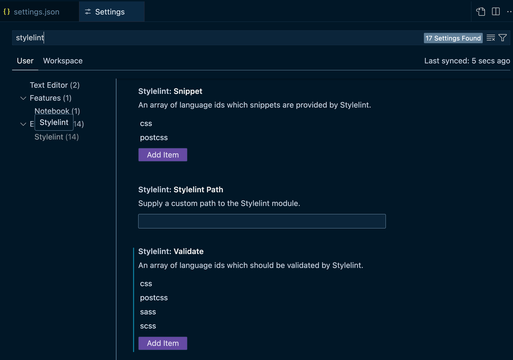

## Stylelint

Важно, чтобы в редакторе подсвечивались ошибки, чтобы разработчик видел и мог поправить.

Пример для vs code stylelint:

1. Нужно установить [расширение](https://marketplace.visualstudio.com/items?itemName=stylelint.vscode-stylelint)

2. В настройках Preferences (UI) найти stylelint и добавить в stylelint validate scss



3. Добавить в Preferences (JSON) следующие строчки, чтобы при сохранении срабатывал автофикс

```
"editor.codeActionsOnSave": {
   "source.fixAll.stylelint": "explicit"
}
```


