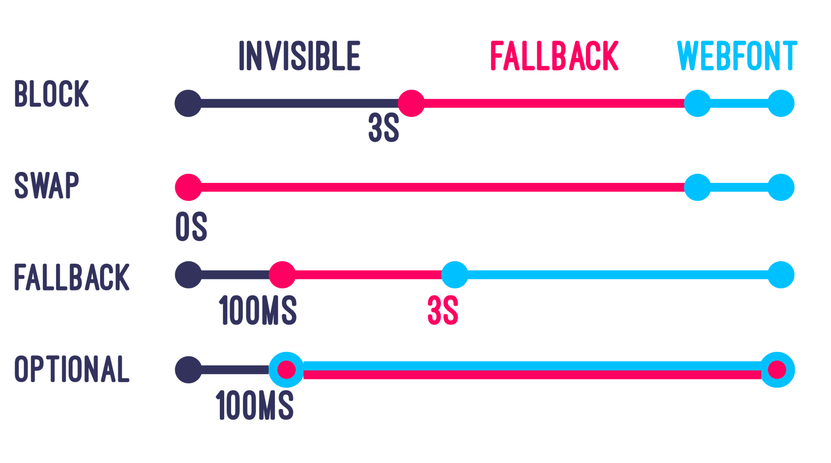
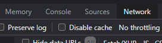

Fonts
==========

Если проект создан на основе нашего бойлерплейта, то для подключения шрифтов на проекте будет два файла
- general/scss/font-face.scss
- general/scss/settings/fonts.scss
  
В первом, как следует из названия, создаются font-face'ы

```
@font-face {
    font-family: 'Avenir Next';
    font-display: swap;
    font-style: normal;
    font-weight: 400;
    src:
        url('../fonts/avenir-next-regular.woff2') format('woff2'),
        url('../fonts/avenir-next-regular.woff') format('woff');
}
```

```
$fonts: (
    ('name': Coolvetica,  'style': normal, 'weight': 400, 'file': 'Coolvetica'),
    ('name': CoolveticaBk,  'style': italic, 'weight': 400, 'file': 'CoolveticaBk-Italic'),
    ('name': CoolveticaBk,  'style': normal, 'weight': 400, 'file': 'CoolveticaBk-Regular'),
    ('name': CoolveticaEl,  'style': italic, 'weight': 400, 'file': 'CoolveticaEl-Italic'),
    ('name': CoolveticaEl,  'style': normal, 'weight': 400, 'file': 'CoolveticaEl-Regular'),
    ('name': CoolveticaHv,  'style': italic, 'weight': 400, 'file': 'CoolveticaHv-Italic'),
    ('name': CoolveticaHv,  'style': normal, 'weight': 400, 'file': 'CoolveticaHv-Regular'),
    ('name': CoolveticaLt,  'style': italic, 'weight': 400, 'file': 'CoolveticaLt-Italic'),
    ('name': CoolveticaLt,  'style': normal, 'weight': 400, 'file': 'CoolveticaLt-Regular'),
    ('name': CoolveticaRg,  'style': normal, 'weight': 400, 'file': 'CoolveticaRg-Regular'),
    ('name': CoolveticaRg,  'style': italic, 'weight': 700, 'file': 'CoolveticaRg-BoldItalic'),
    ('name': CoolveticaRg,  'style': normal, 'weight': 700, 'file': 'CoolveticaRg-Bold'),
    ('name': CoolveticaUl,  'style': italic, 'weight': 400, 'file': 'CoolveticaUl-Italic'),
    ('name': CoolveticaUl,  'style': normal, 'weight': 400, 'file': 'CoolveticaUl-Regular'),
);

@each $font in $fonts {
    @font-face {
        font-family: map-get($font, 'name');
        font-display: swap;
        font-style: map-get($font, 'style');
        font-weight: map-get($font, 'weight');
        src:
            url('../fonts/#{map-get($font, 'file')}.woff2') format('woff2'),
            url('../fonts/#{map-get($font, 'file')}.woff') format('woff'),;
    }
}

```

Во втором создаются  scss переменные для использования в проекте


```
$fallback-font: -apple-system, BlinkMacSystemFont, Segoe UI, Helvetica, Arial,
    sans-serif, 'Apple Color Emoji', 'Segoe UI Emoji', 'Segoe UI Symbol';

$ff-aveny-t: AvenyT, $fallback-font;
$ff-din-pro: DINPro, $fallback-font; 
```

## Fallback Font

```
$fallback-font: -apple-system, BlinkMacSystemFont, Segoe UI, Helvetica, Arial, sans-serif, 'Apple Color Emoji', 'Segoe UI Emoji', 'Segoe UI Symbol';

$font-custom: MyCustomFont, $fallback-font;
```

## Browsers support

- [WOFF2](https://caniuse.com/#search=WOFF2)
- [WOFF](https://caniuse.com/#search=WOFF)

## Вариативные шрифты

К сожалению у нас пока ни один проект их не использует, но это прям будущее. Капайте на мозг вашему дизайнеру с вопросом, почему мы их не используем? Скорее всего он даже не догадывается, о том что существуют такие шрифты.

Показать какие бывают можно тут [https://v-fonts.com](https://v-fonts.com/)

##Font Display
```font-display``` это свойство из @font-face определяет как шрифт будет загружен и отображен браузером.

Возможные значения: 

- auto (default):  по сути полностью совпадает с block.

- block:  Браузер будет резервировать место под текст, но при этом самого текста видно не будет, пока не загрузится шрифт. Такое поведение шрифта называют flash of invisible text или FOIT.

- swap: Пока загружается шрифт, браузер будет отображать текст шрифтом, который у него имеется из списка указанных шрифтов. И как только наш кастомный шрифт загрузился, браузер применит его вместо фолбэек шрифтов. Такое поведение шрифта называют flash of unstyled text или FOUT.

- fallback:  Эдакий компромисс между auto/block и swap.  Браузер будет скрывать текст, в течении первых 100мс, если шрифт все еще не приехал, то тогда будет показываться фолбэк шрифт.  И если наш шрифт успел приехать в течении приблизительно первых трех секунд, то тогда переключится на него.

- optional: как и fallback, это значение говорит браузеру сначала скрыть текст, затем будет показан фолбэк-шрифт.  Но в отличии от значения fallback, браузер может вообще отказаться от загрузки кастомного шрифта, например, в случае медленного интернет соединения.



##FOUT, FOIT.

- FOIT - Flash of Invisible Text

- FOUT - Flash of Unstyled Text

От этих проблем полностью не избавиться, но можно выбрать с какой будем мириться. И выглядит так что FOUT это меньшее из зол.

Больше об этом можно почитать здесь. https://css-tricks.com/fout-foit-foft/

##Web Font Optimization
###Optimization checklist
Вам нужно помочь браузеру оптимизировать загрузку шрифтов и то как он их использует.

- **Проверьте необходимость в шрифтах**: не используйте слишком много шрифтов, и для каждого используемого шрифта число его вариаций. Это поможет в соблюдении консистентности и более быстрой загрузке странице, что положительно сказывается на UX

- **Уберите ненужные подмножества unicode символов**: уберите ненужные языки из вашего шрифта, так для английского сайта совсем не обязательно иметь поддержку всех языков европы и бонусом кирилицу. При необходимости вы можете выделить эти языки в отдельные файлы, и подключать как только они понадобятся. Это положительно скажется на размере файлов и следовательно на скорости загрузки страницы.

- **Используйте актуальные форматы шрифтов**: на данный момент акутален woff2 для всех современных браузеров, и woff для ie11.

- **Используйте preload**: добавьте для ваших шрифтов `<link rel="preload" href="/my-font.woff2" as="font" type="font/woff2"/>` в head тег, и тогда браузер начнет загружать эти шрифты намного раньше, что снизит время их применения.

- **Убедитесь что правильно настроены http заголовки для кэширования шрифтов**: это поможет пользователям загружать эти шрифты меньшее число раз. Если это не так, объясните это тим лиду, что нужно увеличить это значение.

###Кеширование шрифта
Для проверки, что у вас действительно все работает, и шрифт не дергается, не забывайте, что надо выключать галочку **disable cache** в devtools



##Платные шрифты
Как UI разработчикам, нам надо проверять какой шрифт предполагает использовать дизайнер, если он бесплатный то спокойно скачиваем нужные нам версии и используем их в проекте, если же обнаруживается, что шрифт платный, то отправляем запрос к дизайнеру/проект менеджеру/тим лиду о том что нам нужен полный набор шрифтов для проекта.

Проверять в [google fonts](https://fonts.google.com/) и в [fontsquirrel](https://www.fontsquirrel.com/)

