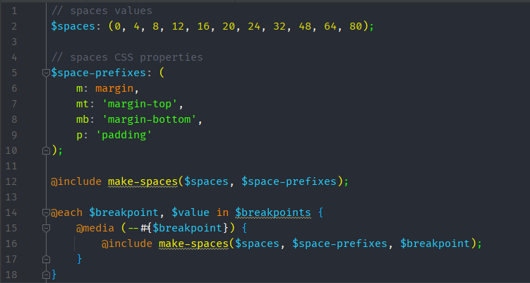
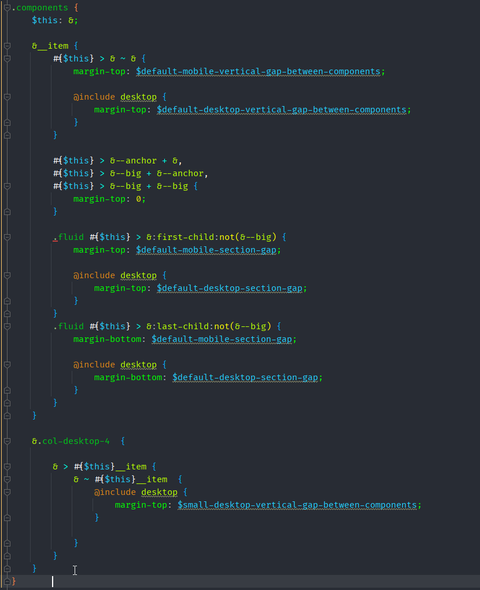
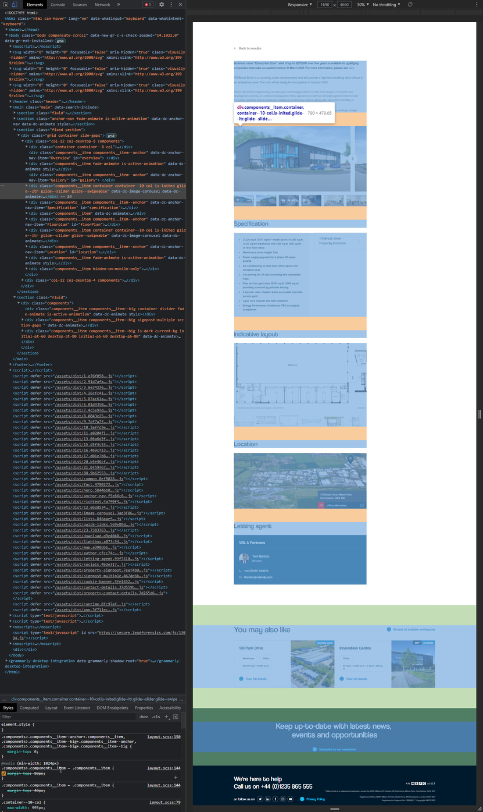

Отступы
==========

## Margin and padding

Разделяйте логику вида и логику отступов.

```
.block {
    &__list {
        display: flex;
    }
  
    &__item {    
        & + & {
            margin-top: 10px;
        }
    } 
  
    &__card {
        padding: 10px;
        bacground-color: $color-black;
    }
  
    &__link {
        font-size: 14px;
        color: $color-red;        
    }
}
```

## Spaces
Хелперы для вертикальных отступов между элементами.

Очень полезно, когда у вас на проекте имеются десятки разных Hero компонентов, и все плюс минус похожи друг на друга, с небольшой разницей в отступах между комопнентами. В классическом варианте Бэма пришлось бы заводить десятки модификаторов на каждый вариант Hero со своими отступами. С хелпер классами это получится сделать проще. 

**spaces.scss**



```
// spaces values
$spaces: (0, 4, 8, 12, 16, 20, 24, 32, 48, 64, 80);

// spaces CSS properties
$space-prefixes: (
    m: margin,
    p: padding,
    mt: 'margin-top',
    mb: 'margin-bottom',
);

@mixin make-spaces($spaces, $prefixes, $breakpoint: 'initial') {
    @each $attr-short, $attr-long in $prefixes {
        @each $value in $spaces {
            // on mobile all spaces are 0 by default

            @if ($breakpoint == 'mobile' and $value == 0) {
                // do nothing
            }

            @else {
                @if ($attr-short == 'p' or $attr-short == 'm') {
                    .#{$breakpoint}-#{$attr-short}-#{$value} {
                        #{$attr-long}-top: #{$value/16 + rem};
                        #{$attr-long}-bottom: #{$value/16 + rem};
                    }
                }

                @else {
                    .#{$breakpoint}-#{$attr-short}-#{$value} {
                        #{$attr-long}: #{$value/16 + rem};
                    }
                }
            }
        }
    }
}

@include make-spaces($spaces, $space-prefixes);

@include tablet {
    @include make-spaces($spaces, $space-prefixes, 'tablet');
}

@include desktop {
    @include make-spaces($spaces, $space-prefixes, 'desktop');
}
```

```
<div class="hero">
    <div class="hero__container initial-p-20 tablet-p-32 desktop-p-48">
        <h1 class="hero__title">
            Hero title lorem ipsum
        </h1>
        <p class="hero__description initial-mt-20 initial-mb-32 desktop-mt-64 desktop-mb-64">
            Lorem ipsum dolor sit amet, consectetur adipisicing elit. Alias delectus doloribus eius error facilis neque provident quam qui velit voluptates?
        </p>
        <a href="hero__link standart-button" href="/">
            Go to homepage
        </a>
    </div>
</div>
```

## Оступы компонентов

Дизайнеры закладывают в проекты некую логику отступов между компонентами. Зачастую она не поддается описанию, и если она не прослеживается, то у вас гарантированно будут вылазить баги, о том, что эти отступы не соответствуют дизайну, т.к. контент менеджеры вольны выдумывать любую комбинацию порядка компонентов.

Проактивным решением является стилевой блок .components

Нужно вытрясти с дизайнера логику, и описать с ним на пальцах/бумажке, то как он видит логику отступов между компонентами на проекте.

На момент написания статьи этот блок все еще претерпевает изменения.






