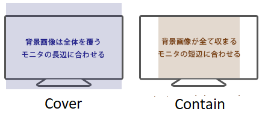

Media (image, video)
==========

## Aspect Ratio Boxes

В CSS пока что нету хорошо работающей функции aspect-ratio(но она разрабатывается, и на момент написания статьи поддерживается в firefox nightly), т.е. мы не можем простым и легким способом заставить контейнер сохранять нужные пропорции. 

Поэтому используется хак процентного паддинга. Паддинг в процентах всегда считается от **ширины** родителя, и неважно в какую сторону направлен этот паддинг. Т.е. ```padding-top: 10%``` будет равен 10-й части ширины родителя. Остается только в этот контейнер вписать дочерние элементы абсолютом.

Разделите высоту на ширину и заверните в percentage.

Пример: percenatege(9 / 16) = 56.25%

```
.parent {
    position: relative;

    &::before {
        content: '';
        display: block;
        padding-top: percenatege(9/16);
    }
    
.child-image,
.child-video {
    position: absolute;
    left: 0;
    top: 0;
    width: 100%;
    height: 100%;
}
```

## Object fit helpers

По умолчанию тег ```img``` не умеет в изменение рамера картинки без деформации, т.е. если ему ничего не задать, то при ресайзе окна и недостаточном размере контейнера, картинку бюдет "плющить".

Чтобы такого не происходило, следует использовать свойство ```object-fit```.

Возможные значение: ```cover``` или ```contain```

```cover``` - будет увеличивать картинку так, чтобы в контейнере не осталось бы свободного места, т.е. часть картинки может быть обрезана.

```contain``` - будет вписывать картинку в контейнер, т.е. чтобы контент картники влез бы полностью, и ничего бы не обрезалось, но могут остаться пустые места в контейнере.



```
.of-cover,
.of-contain {
    & > img,
    & > video {
        position: absolute;
        top: 0;
        left: 0;
        display: block;
        width: 100%;
        height: 100%;
    }
}

.of-cover {
    & > img,
    & > video {
        object-fit: cover;
    }
}

.of-contain {
    & > img,
    & > video {
        object-fit: contain;
    }
}
```

## Обрезанные головы

Т.к. большинство используемых картинок в проекте вставляются контент менеджерами не обдуманно, это может приводить к курьезным ситуациям. Например контент менеджер создал статью про своего лучшего игрока футбольной команды, и вставил в статью фотографии с его участием, а на thumbnail картинку поставил фотографию с наилучшего ракурса. Вроде бы все замечательно, но на выходе, он видит, что карточка статьи о топ игроке отрезала этому игроку голову.

Причина кроется в том, что контент менеджер использовал не подходящий aspect ratio картинки под использумый контейнер. Т.е. он вставил портретно-ориентированную картинку в место, которое отображается как лэндскейп, и картинка следуя css правилу object-fit: cover растянулась на всё доступное пространство и голова спортсмена просто уехала за границу контейнера. 

Это типичная ситуация, для которой есть два пути решения: 

- изменить общий ```object-position: center 33.3%``` что ограничит появление таких ситуаций, и не сильно навредит всем оставшимся картинкам, но не является серебряной пулей.

- если есть такая возможность в CMS, настроить focal point для конкретной картинки. У нас есть готовое решение для сайткора и умбрако. Также подобное решение есть из коробки в Bridge от incrowd.

## Lazyload

Если картинка контентная, то с наибольшей вероятностью, она должна быть lazyload.

Исключение: Hero компоненты, т.к. они появляются на виду у пользователя первыми, и lighthouse срезает очки за увеличение **FCP**

Все контентные картинки должны хоститься в CMS/CDN

Мы используем [Lazysizes plugin](https://github.com/aFarkas/lazysizes).

**JS**
```
// object fit pollyfill for ie
import 'lazysizes/plugins/object-fit/ls.object-fit';
// data-src set
import 'lazysizes/plugins/respimg/ls.respimg';
// img sizes based on parent size
import 'lazysizes/plugins/parent-fit/ls.parent-fit';

// lib
import 'lazysizes';

window.lazySizesConfig = window.lazySizesConfig || {};
// fix min width to download(default 40px)
window.lazySizesConfig.minSize = 0;
```

**CSS**

```
.lazyload,
.lazyloading {
    opacity: 0;
}

.lazyloaded {
    opacity: 1;
    transition: opacity 300ms;
}
```

**Исходный HTML**
```

```

**Результат в DOM**
```

```

## Background video

В моей практике, для фонового видео лучше всего использовать нативный html5 плеер, и хостить видео где нибудь в CMS/CDN.

```
<div class="lazyload" data-dc-bg-video>
    <video class="mid-page-video__video" data-dc-bg-video-ref="video" playsinline -webkit-playsinline muted loop preload="none">
        <source src="@video.Link" type="video/mp4">
    </video>
</div>
```

```
import { BaseComponent } from 'project/general';

class BackgroundVideoComponent extends BaseComponent {
    static getNamespace() {
        return 'bg-video';
    }

    init = () => {
        if (this.element.matches('.lazylaoded')) {
            this.play();
        } else {
            this.addListener(this.element, 'lazyloaded', this.play);
        }
    };

    play = () => {
        const { video } = this.refs;
        video.setAttribute('autoplay', '');
        video.play();
        this.destroy();
    };
}
```
