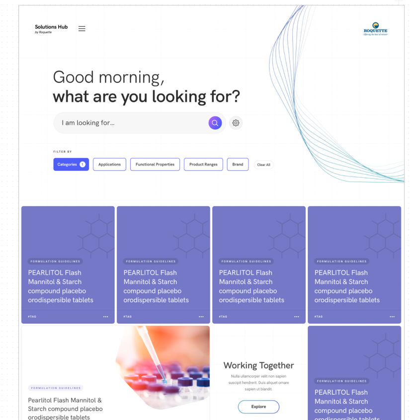
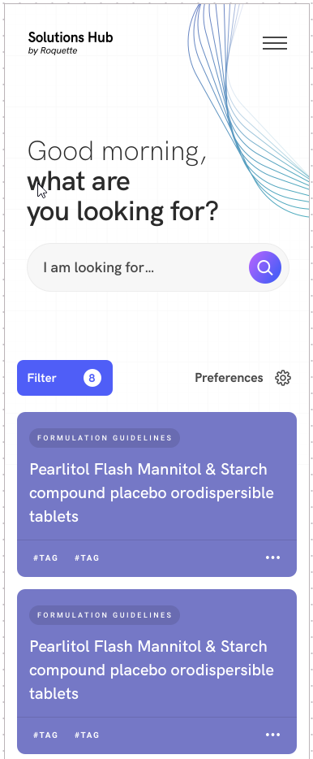
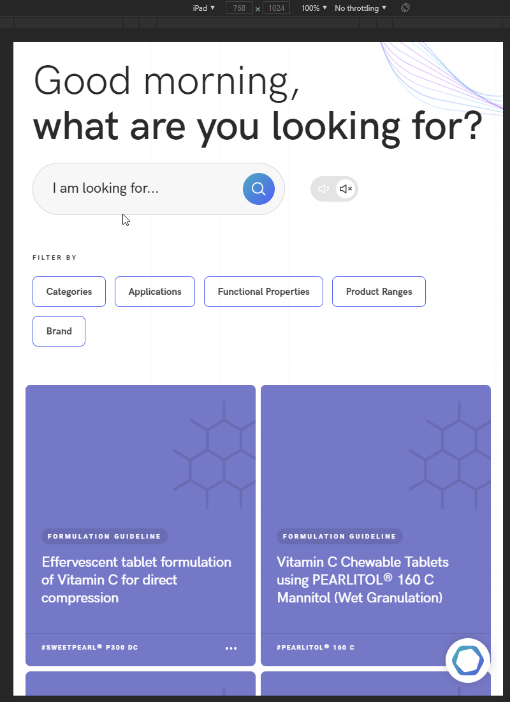
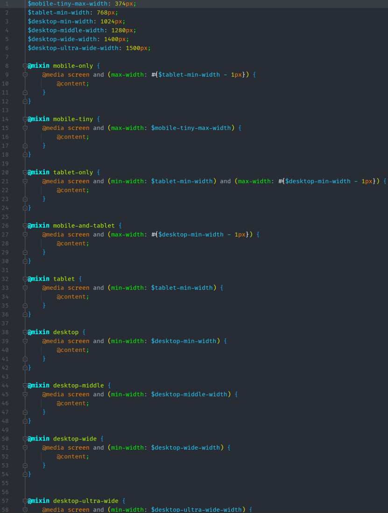

Responsive
==========


Какие вьюпорты мы поддерживаем?
-------------------------------

Мы поддерживаем все вьюпорты начиная от 320 в ширину (iPhone 5) и заканчивая 4k экранами.

Но так как на 4к дизайны никто не делает, надо сделать чтобы на них просто не было все сломано

Не забывайте о картинках в дизайне как нарисованных от края до края.

Поддерживаем ли мы Landscape режим для мобилок?
-----------------------------------------------

Да, но только если для этого есть требования, в остальных случаях, мы не должны уделять этому много времени.

Основной прицип Mobile-first
----------------------------

Это значит, что если вы начинаете делать компонент, создайте сначала мобильную версию, и потом уже расширьте ее до десктопа.

```
.header {
    &__inner {
        display: flex;
        align-items: center;
        
        @include desktop {
            justify-content: space-between;
        }
    }
    
    &__item {
        padding: 15px;
        font-size: 14px;
        
        @include desktop {
            padding: 30px;
        }
    }
}
```

Tablet designs
--------------

Как правило, дизайнеры не уделяют времени для для создания отдельного дизайна для таблетов. Так что используйте свое чуство прекрасного, чтобы получилась вменяемая дочерняя вариация имеющихся мобильного и десктопного дизайнов.

Пример:

**Desktop design:**




**Mobile design:**



**Результат для tablet:**



Breakpoints
-----------

### Breakpoints в стилях

у нас есть отдельный .scss файл `breakpoints.scss` со списком всех возможных брейкпоинтов исползующихся на проекте



Вы можете использовать не mobile-first миксины, такие как `mobile-only` bkb `tablet-mobile` , в том случае, если вам потребуется переопределять слишком много стилей для десктопа, по сравнению с подходом mobile-first.

Связанный Code style
--------------------

Старайтесь описывать всё поведение элемента в самом элементе, ненадо размазывать логику по блоку, и тем более не надо пытаться скомбинировать одинаковые брейкпоинты.

### Breakpoints in JS

Для JS, у нас есть [DeviceObserver](https://github.com/Delete-Agency/device-observer) \- это наш самописный плагин, определяющий размер вьюпорта, и позволяющий нам следить за изменениями размеров.

Основной набор размеров для брейкопинтов.
-----------------------------------------

*   mobile: 0,
    
*   mobile-tiny: 375,
    
*   tablet: 768,
    
*   desktop: 1024,
    
*   desktop-wide: 1280,
    
*   desktop-extra-wide: 1440
    


